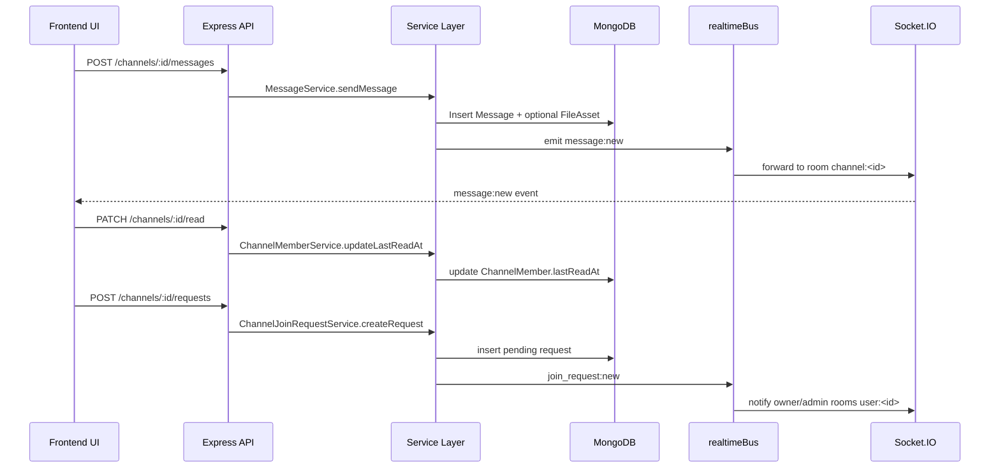

# README MODULE 3 - Meeting App

Tai lieu nay mo ta chi tiet Module 3 da duoc trien khai trong code hien tai cua du an, gom:

- Channel Directory
- Private Channel Join Request
- Channel Chat Realtime
- Thread Replies
- Reactions
- File Sharing (Cloudinary)
- Notification Realtime
- Presence + Typing + Meeting signaling

Muc tieu cua tai lieu:

1. Giup nhin ro luong code end-to-end tu frontend den backend.
2. Lam tai lieu onboard cho team moi vao du an.
3. Lam baseline de tiep tuc phase tiep theo (hardening, testing, optimization).

---

## 1. Tong quan kien truc Module 3

### 1.1 Kien truc tong the

Du an tach 2 app:

- backend: Express + Mongoose + Socket.IO + TypeScript
- frontend: Next.js App Router + React + Zustand + React Query + Socket.IO Client

Module 3 tap trung vao collaboration domain:

- quan ly channel theo workspace
- private/public access flow
- realtime chat
- metadata collaboration (thread/reaction/files/notifications)

### 1.2 Startup flow backend

File chinh: backend/src/server.ts

Flow khoi dong:

1. Nap bien moi truong (dotenv).
2. Tao Express app + HTTP server.
3. Gan middleware CORS + parse JSON.
4. Mount REST router tai /api/v1.
5. Tao Socket.IO server va goi setupSocketHandlers(io).
6. Ket noi MongoDB qua Mongoose.
7. Expose health endpoint GET /.

### 1.3 Startup flow frontend lien quan Module 3

Dashboard layout mount PresenceBootstrap:

- frontend/src/app/(dashboard)/layout.tsx
- frontend/src/components/realtime/PresenceBootstrap.tsx

PresenceBootstrap se:

1. apply dev auth fallback (neu dev mode).
2. lay token tu localStorage hoac auth store.
3. goi useSocket(token) de mo ket noi socket toan cuc.

Ket qua: Sidebar, Channel Directory, Channel Chat, Notification dropdown dung chung socket state.

---

## 2. Route map thuc te (dang mount trong code)

File route root: backend/src/routes/index.ts

Dang mount:

- /workspaces -> Workspace.route.ts
- /channels -> channelJoinRequest.routes.ts
- /channels -> channelMember.routes.ts
- / -> message.routes.ts
- / -> threadReply.routes.ts
- / -> file.routes.ts
- /notifications -> notification.routes.ts
- / -> workspaceInvite.routes.ts

Luu y quan trong:

- Route channel directory theo workspace KHONG mount truc tiep o index.ts.
- Workspace.route.ts mount nested: /:workspaceId/channels -> channel.routes.ts.
- Vi vay endpoint directory dung la /api/v1/workspaces/:workspaceId/channels.

---

## 3. Bien moi truong can cho Module 3

### 3.1 Backend env

Toi thieu:

- PORT
- FRONTEND_URL
- MONGODB_URI
- JWT_SECRET

Cho file sharing Cloudinary:

- CLOUDINARY_CLOUD_NAME
- CLOUDINARY_API_KEY
- CLOUDINARY_API_SECRET
- CLOUDINARY_UPLOAD_FOLDER (optional, mac dinh meeting-app/channels)

### 3.2 Frontend env

Toi thieu:

- NEXT_PUBLIC_BACKEND_URL

Cho development nhanh:

- NEXT_PUBLIC_DEV_TOKEN
- NEXT_PUBLIC_DEV_USER_ID
- NEXT_PUBLIC_DEV_USER_EMAIL
- NEXT_PUBLIC_DEV_USER_NAME
- NEXT_PUBLIC_DEV_USERS (JSON optional)

---

## 4. Database models cua Module 3

## 4.1 Channel

File: backend/src/models/Channel.model.ts

Field chinh:

- workspaceId
- name, slug, description
- type: public | private
- category
- createdBy
- members (legacy compatibility)
- memberCount
- isArchived
- lastMessageAt

Index:

- { workspaceId, slug } unique
- { workspaceId, type }
- { lastMessageAt: -1 }

## 4.2 ChannelMember

File: backend/src/models/ChannelMember.model.ts

Field:

- channelId, userId, workspaceId
- role: owner | admin | member
- joinedAt, lastReadAt
- isMuted, isFavorite

Index:

- { channelId, userId } unique
- { userId, workspaceId }
- { channelId, role }

## 4.3 ChannelJoinRequest

File: backend/src/models/ChannelJoinRequest.model.ts

Field:

- channelId, workspaceId
- senderId, recipientId
- type: invite | request
- status: pending | accepted | rejected | expired | revoked
- message

Index:

- { channelId, status }
- { recipientId, status }
- { senderId, status }
- { channelId, senderId, status }

## 4.4 Message

File: backend/src/models/Message.model.ts

Field:

- workspaceId, channelId, userId
- type: text | file | system | meeting
- content
- attachments[]
- mentions[]
- threadCount
- isPinned
- isEdited, editedAt
- isDeleted, deletedAt

Index:

- { channelId, createdAt: -1 }
- text index tren content
- { channelId, isPinned }

## 4.5 ThreadReply

File: backend/src/models/ThreadReply.model.ts

Field:

- parentMessageId, channelId, workspaceId, userId
- content, attachments
- isEdited/isDeleted metadata

Index:

- { parentMessageId, createdAt: -1 }

## 4.6 MessageReaction

File: backend/src/models/MessageReaction.model.ts

Field:

- messageId, channelId, workspaceId, userId, emoji

Index:

- { messageId, emoji }
- { messageId, userId, emoji } unique

## 4.7 FileAsset

File: backend/src/models/FileAsset.model.ts

Field:

- cloudinaryUrl, cloudinaryPublicId
- fileName, mimeType, size
- uploadedBy, channelId, workspaceId, messageId

Index:

- { channelId, createdAt: -1 }

## 4.8 Notification

File: backend/src/models/Notification.model.ts

Loai:

- join_request
- request_approved
- message
- mention
- thread_reply
- meeting_start

Index:

- { userId, isRead, createdAt: -1 }

## 4.9 Meeting

File: backend/src/models/Meeting.model.ts

Field:

- channelId, workspaceId, createdBy, title
- status: scheduled | live | ended
- startedAt, endedAt
- participants[]

Index:

- { channelId, status, createdAt: -1 }

---

## 5. Auth va permission flow

## 5.1 HTTP auth

File: backend/src/middlewares/auth.middleware.ts

Flow:

1. Lay Authorization: Bearer token.
2. Verify bang JWT_SECRET.
3. Gan vao req.user.
4. Fail 401 neu token khong hop le.

## 5.2 Socket auth

File: backend/src/sockets/socket.middleware.ts

Flow:

1. Lay token tu socket.handshake.auth.token.
2. Verify JWT.
3. Gan socket.data.user.
4. Tu choi ket noi neu token sai/thieu.

## 5.3 Permission middleware va service

Middleware: backend/src/middlewares/permission.middleware.ts

- requireWorkspaceMember
- requireWorkspaceMemberByChannel
- requireWorkspaceRole
- requireChannelMember
- requireFavoriteAccess

Business service: backend/src/services/Permission.service.ts

- isWorkspaceOwnerOrAdmin
- canJoinChannel
- canModifyChannel
- canApproveRequest
- canSendMessage

---

## 6. REST APIs da co trong Module 3

## 6.1 Workspace + Channel Directory

- GET /api/v1/workspaces/me
- POST /api/v1/workspaces
- DELETE /api/v1/workspaces/:workspaceId

Channel directory (workspace-scoped):

- GET /api/v1/workspaces/:workspaceId/channels
- GET /api/v1/workspaces/:workspaceId/channels/:channelId
- POST /api/v1/workspaces/:workspaceId/channels
- PATCH /api/v1/workspaces/:workspaceId/channels/:channelId
- DELETE /api/v1/workspaces/:workspaceId/channels/:channelId
- PATCH /api/v1/workspaces/:workspaceId/channels/:channelId/archive

Query support:

- search
- type
- category
- page, limit
- sort

## 6.2 Channel Member actions

Base: /api/v1/channels

- GET /:channelId
- POST /:channelId/join
- POST /:channelId/leave
- DELETE /:channelId
- GET /:channelId/members
- GET /:channelId/invite-candidates
- POST /:channelId/invite
- PATCH /:channelId/mute
- PATCH /:channelId/favorite
- PATCH /:channelId/read

## 6.3 Private Join Request

Base: /api/v1/channels

- POST /:channelId/requests
- GET /:channelId/requests
- PATCH /:channelId/requests/:requestId/approve
- PATCH /:channelId/requests/:requestId/reject
- GET /my-pending-requests
- GET /my-requests

## 6.4 Messages + pin + reactions

Base: /api/v1

- GET /channels/:channelId/messages
- POST /channels/:channelId/messages
- PATCH /messages/:messageId
- DELETE /messages/:messageId
- GET /channels/:channelId/pinned
- PATCH /messages/:messageId/pin
- PATCH /messages/:messageId/unpin
- POST /messages/:messageId/reactions
- DELETE /messages/:messageId/reactions/:emoji

## 6.5 Thread Replies

- GET /api/v1/messages/:messageId/replies
- POST /api/v1/messages/:messageId/replies
- PATCH /api/v1/replies/:replyId
- DELETE /api/v1/replies/:replyId

## 6.6 Files

- GET /api/v1/files/open
- GET /api/v1/files/download
- POST /api/v1/files/upload
- GET /api/v1/channels/:channelId/files
- GET /api/v1/channels/:channelId/media
- GET /api/v1/channels/:channelId/links

## 6.7 Notifications

- GET /api/v1/notifications
- GET /api/v1/notifications/unread-count
- PATCH /api/v1/notifications/read-all
- PATCH /api/v1/notifications/:notificationId/read
- DELETE /api/v1/notifications/:notificationId

---

## 7. Luong code chi tiet theo feature

## 7.1 Channel Directory flow

Backend:

1. Channel.controller.getChannelDirectory nhan query.
2. ChannelService.getChannelDirectory goi ChannelDAO.findByWorkspace.
3. Service enrich them voi latest message bang aggregate Message.
4. Service tinh unreadCount/mentionCount dua tren ChannelMember.lastReadAt + Message.mentions.
5. Tra data + meta.

Frontend:

1. channels/page.tsx lay danh sach workspace.
2. useQueries goi channelApi.getChannelDirectory cho tung workspace.
3. merge ket qua va enrich local realtime overrides.
4. render tabs all/joined/unread/favorites/archived.
5. lang nghe socket event channel:activity:update de cap nhat preview + unread + mention.

## 7.2 Create/Join/Leave/Favorite/Read flow

Create channel:

- validate input
- check workspace plan limit
- tao slug unique
- tao Channel + ChannelMember owner
- tang workspace.channelCount

Join channel:

- check canJoinChannel
- add member qua ChannelMemberService
- sync vao Channel.members (legacy)
- tao system message "joined the channel"
- emit channel:member:added

Leave channel:

- xoa ChannelMember
- pull khoi Channel.members
- tao system message "left the channel"
- emit channel:member:removed

Favorite/mute:

- update ChannelMember.isFavorite/isMuted

Mark read:

- update ChannelMember.lastReadAt
- frontend debounce goi PATCH /channels/:id/read

## 7.3 Private request flow

Create request:

1. check channel ton tai, khong archived.
2. check user chua la member.
3. check user thuoc workspace.
4. neu channel public -> return autoJoined semantic.
5. neu private -> check duplicate pending.
6. tao request status pending.
7. emit join_request:new.
8. tao notifications cho owner/admin.

Approve request:

1. check request pending.
2. check quyen owner/admin.
3. add sender vao channel.
4. set status accepted.
5. emit join_request:approved.
6. tao notification request_approved cho sender.

Reject request:

1. check request pending.
2. check quyen owner/admin.
3. set status rejected.
4. emit join_request:rejected.
5. tao notification thong bao reject.

## 7.4 Message flow

Send message:

1. check membership qua canSendMessage.
2. validate phai co content hoac attachments.
3. tao message.
4. neu co attachments -> persist vao FileAsset.
5. update channel.lastMessageAt.
6. mention notification cho member duoc mention.
7. emit message:new.

Get messages:

- ho tro cursor before/after
- attach author profile tu users collection
- attach reaction aggregate tu MessageReaction

Edit/delete:

- edit chi cho owner message
- delete cho sender hoac workspace owner/admin
- delete la soft-delete

Pin/unpin:

- channel member co quyen pin/unpin
- update isPinned
- tao system notice pin/unpin
- emit message:pin/message:unpin va message:new (system)

## 7.5 Reaction flow

Add reaction:

- upsert (messageId, userId, emoji)
- lay detailed message de patch reactions tong hop
- emit reaction:add + message:update

Remove reaction:

- delete theo (messageId, userId, emoji)
- emit reaction:remove + message:update

## 7.6 Thread flow

Create reply:

1. check parent message + membership.
2. tao ThreadReply.
3. tang parent Message.threadCount.
4. notify parent author (neu khac nguoi reply).
5. emit thread:reply:new kem threadCount.

Edit/delete reply:

- owner reply hoac workspace owner/admin moi duoc phep
- delete la soft-delete
- giam threadCount parent khi delete lan dau
- emit thread:reply:update/delete

## 7.7 File sharing flow

Upload:

1. frontend goi /files/upload de lay signature.
2. frontend upload truc tiep len Cloudinary bang uploadUrl.
3. khi send message co attachments -> backend persist metadata FileAsset.

Read assets:

- /channels/:id/files -> tat ca file
- /channels/:id/media -> image/video
- /channels/:id/links -> parse links tu message content

Download/open:

- /files/open va /files/download proxy qua backend
- validate host Cloudinary
- voi PDF/raw dung signed private_download_url

## 7.8 Notification flow

Sources tao notification:

- join request moi
- request approved/rejected
- mention trong message
- thread reply
- meeting start

Notification service:

- createNotification / createManyNotifications
- get list + unread count
- mark single/all read
- delete
- emit notification:new/update/delete qua realtimeBus

---

## 8. Socket realtime map

Socket setup: backend/src/sockets/index.ts

Connection flow:

1. socket auth middleware verify JWT
2. socket join room user:<userId>
3. register presence/channel/message/typing/meeting handlers
4. register bus handlers message/channel/request/meeting/notification

## 8.1 Bus handlers

Message domain:

- message:new, message:update, message:delete
- message:pin, message:unpin
- reaction:add, reaction:remove
- thread:reply:new/update/delete
- channel:activity:update

Channel domain:

- channel:member:added
- channel:member:removed

Request domain:

- join_request:new
- join_request:approved
- join_request:rejected

Notification domain:

- notification:new
- notification:update
- notification:delete

Meeting domain:

- meeting:start
- meeting:end

## 8.2 Client-origin events

Frontend gui len:

- channel:join, channel:leave
- message:new, message:update, message:delete
- typing:start, typing:stop
- presence:activity
- meeting:start, meeting:end

Tat ca event quan trong co ack callback voi success flag.

---

## 9. Frontend implementation map chi tiet

## 9.1 Pages

Channel Directory:

- frontend/src/app/(dashboard)/channels/page.tsx

Da co:

- load channels theo tung workspace
- search/filter/sort
- tab status
- join/leave/request/favorite/delete
- realtime unread/mention/activity updates

Channel Chat:

- frontend/src/app/(dashboard)/channels/[channelId]/page.tsx

Da co:

- resolve channel theo id hoac slug
- load detail + members
- infinite messages
- optimistic send
- edit/delete/pin/unpin
- reactions
- thread panel
- typing + presence
- invite members
- right sidebar members/files/pinned/activity
- meeting banner handling
- mark-read debounce

## 9.2 Stores

channelStore:

- channels, currentChannel, filters
- pendingRequests, selectedRequestId
- total/totalPages

messageStore:

- messages sorted ASC by createdAt
- typingUsers, onlineUsers
- currentThreadId
- clearChannelState

socketStore:

- socket, isConnected, activeRoom
- joinRoom/leaveRoom
- emitMessage/emitTyping

authStore:

- user, token, isAuthenticated
- setDevUser

## 9.3 Hooks + service layers

Hooks:

- useChannels
- useMessages
- useThreadReplies
- usePendingRequests
- useWorkspaces
- useSocket

Services:

- api.ts (axios base + auth interceptor)
- channelApi.ts
- messageApi.ts
- threadReplyApi.ts
- fileApi.ts
- notificationApi.ts
- socket.ts

---

## 10. Sequence flow tong hop

---

## 11. Test coverage Module 3

Thu muc test: backend/src/**tests**

Dang co:

- channel.phase2.test.ts: smoke check
- channelJoinRequest.phase3.test.ts: smoke method existence
- message.phase4.test.ts: smoke MessageService/DAO
- socket.phase5.test.ts: socket auth middleware + setup
- message.phase7.test.ts: integration test voi mongodb-memory-server
- socket.phase7.test.ts: socket handlers + realtime forwarding

Danh gia:

- Message API da co integration test kha tot.
- Channel directory/request/thread/files/notification can bo sung integration tests sau.

---

## 12. Muc do hoan thanh theo yeu cau Module 3

Da dat duoc:

- Channel Directory API + UI thuc te
- Public/private join flow + request approval
- Realtime chat hoat dong
- Thread replies + reaction sync
- File upload signature + file/media/link panel APIs
- Notification list + unread + realtime push
- Presence/typing/meeting socket signaling

Can tiep tuc hardening:

- tang test coverage end-to-end
- optimize realtime bus cho multi-instance deployment
- bo sung monitoring/logging cho event errors
- bo sung chinh sach retry/rollback cho cac thao tac phuc hop

---

## 13. Notes quan trong cho team

1. Endpoint channel directory dung la workspace-scoped, khong phai /api/v1/channels.
2. Frontend channel page hien tai resolve duoc ca ObjectId va slug segment.
3. Realtime auth trong dev phu thuoc accessToken localStorage + useSocket bootstrap.
4. Channel.members van duoc duy tri song song voi ChannelMember de backward compatibility.
5. Cloudinary raw/PDF can di qua signed url helper de tranh loi open/download.

---

## 14. Lenh chay nhanh

Backend:

- cd backend
- npm install
- npm run dev

Frontend:

- cd frontend
- npm install
- npm run dev

Test backend:

- cd backend
- npm test

---

## 15. Ket luan

Module 3 trong code hien tai da vuot qua muc mock UI va da co du collaboration backbone:

- Domain models day du
- REST APIs cho channel/chat ecosystem
- Permission checks nhieu lop
- Realtime architecture qua Socket.IO
- Frontend state + UX flow ket noi duoc backend

README_MODULE3.MD la tai lieu technical baseline de tiep tuc cac phase sau ma khong mat ngu canh nghiep vu da lam.
